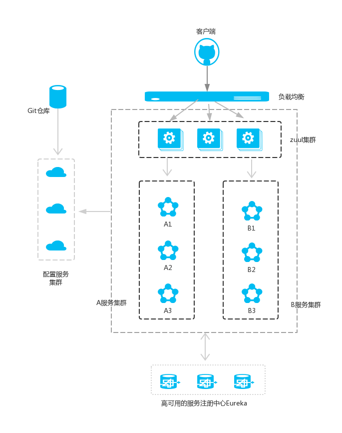

###    SpringCloud


#### 注册中心 eureka

是一个服务注册和发现模块。

@EnableEurekaServer  启动一个服务注册中心

```yaml
eureka:
  client:
    registerWithEureka: false
    fetchRegistry: false # 表明自己是一个 server
```


#### 提供服务

@EnableEurekaClient 表明自己是一个eureka client，还需要在配置文件中注明自己的服务注册中心的地址

(这里真正的处理请求(供其他服务器调用))                                    

```yaml
spring:
  application:
    name: service-hi # 服务之间的根据名字进行互相调用
```


#### ribbon + restTemplate 消费服务

ribbon 是一个负载均衡客户端，可以很好的控制 http 和 tcp 的一些行为。Feign 默认集成了 ribbon

@EnableDiscoveryClient 向服务中心注册；并且向程序的 ioc 注入一个 bean: restTemplate;

@LoadBalanced 注解表明这个 restTemplate 开启负载均衡的功能

(这里通过 Controller 接收请求，然后转发到上面真正的处理请求)

```java
@Bean
@LoadBalanced
RestTemplate restTemplate() {
    return new RestTemplate();
}
```


- 一个服务注册中心，eureka server,端口为8761
- service-hi工程跑了两个实例，端口分别为8762,8763，分别向服务注册中心注册
- service-ribbon端口为8764,向服务注册中心注册
- 当service-ribbon通过restTemplate调用service-hi的hi接口时，因为用ribbon进行了负载均衡，会轮流的调用service-hi：8762和8763 两个端口的hi接口；


#### feign 消费服务

Feign是一个声明式的伪Http客户端，它使得写Http客户端变得更简单。

Feign默认集成了Ribbon，并和Eureka结合，默认实现了负载均衡的效果。

1. @EnableFeignClients 注解开启Feign的功能

2. 定义一个feign接口，通过@ FeignClient（“服务名”），来指定调用哪个服务

3. 在Web层的controller层，对外暴露API接口，通过上面定义的Feign客户端接口来消费服务


#### 断路器 Hystrix

在微服务架构中，根据业务来拆分成一个个的服务，服务与服务之间可以相互调用（RPC），在Spring Cloud可以用RestTemplate+Ribbon和Feign来调用。为了保证其高可用，单个服务通常会集群部署。由于网络原因或者自身的原因，服务并不能保证100%可用，如果单个服务出现问题，调用这个服务就会出现线程阻塞，此时若有大量的请求涌入，Servlet容器的线程资源会被消耗完毕，导致服务瘫痪。服务与服务之间的依赖性，故障会传播，会对整个微服务系统造成灾难性的严重后果，这就是服务故障的“雪崩”效应。

Netflix开源了Hystrix组件，实现了断路器模式，SpringCloud对这一组件进行了整合。

较底层的服务如果出现故障，会导致连锁故障。当对特定的服务的调用的不可用达到一个阀值（Hystric 是5秒20次） 断路器将会被打开。

断路打开后，可用避免连锁故障，fallback方法可以直接返回一个固定值。

在**消费服务的代码**中进行配置

1. ribbon 中使用断路器

   @EnableHystrix 注解开启Hystrix

   在 Service 方法上加上 @HystrixCommand 注解。该注解对该方法创建了熔断器的功能，并指定了 fallbackMethod 熔断方法

    ```java
    @HystrixCommand(fallbackMethod = "hiError")
    public String hiService(String name) {
        return restTemplate.getForObject("http://SERVICE-HI/hi?name=" + name, String.class);
    }
    public String hiError(String name) {
        return "hi, " + name + ", sorry error!";
    }
    ```

2. feign 中使用断路器

   在 Service 接口 注解上加上指定的类

   ```java
   @FeignClient(value = "service-hi", fallback = SchedualServiceHiHystric.class)
   public interface SchedualServiceHi {
       @RequestMapping(value = "/hi", method = RequestMethod.GET)
       String sayHiFromClientOne(@RequestParam(value = "name") String name);
   }
   ```


Hystrix Dashboard（仪表盘）

主程序启动类(消费服务的代码)中加入 @EnableHystrixDashboard 注解，开启 hystrixDashboard


#### Zuul 路由转发 + 过滤器

在微服务架构中，需要几个基础的服务治理组件，包括服务注册与发现、服务消费、负载均衡、断路器、智能路由、配置管理等，由这几个基础组件相互协作，共同组建了一个简单的微服务系统。



**A服务和B服务是可以相互调用的，并且配置服务也是注册到服务注册中心的。**

在Spring Cloud微服务系统中，一种常见的负载均衡方式是，客户端的请求首先经过负载均衡（zuul、Ngnix），再到达服务网关（zuul集群），然后再到具体的服务。服务统一注册到高可用的服务注册中心集群（Eureka），服务的所有的配置文件由配置服务管理，配置服务的配置文件放在git仓库，方便开发人员随时改配置。

Zuul的主要功能是路由转发和过滤器，默认和Ribbon结合实现了负载均衡的功能。


@EnableZuulProxy，开启zuul的功能

 ```yaml
 eureka:
   client:
     serviceUrl:
       defaultZone: http://localhost:8761/eureka/ # 首先指定服务注册中心的地址为
 server:
   port: 8769
 spring:
   application:
     name: service-zuul # 服务名为
 zuul:
   routes:
     api-a:
       path: /api-a/**
       serviceId: service-ribbon # 以/api-a/ 开头的请求都转发给service-ribbon服务
     api-b:
       path: /api-b/**
       serviceId: service-feign # 以/api-b/开头的请求都转发给service-feign
 ```

**服务过滤**

zuul不仅只是路由，并且还能过滤，做一些安全验证

```java
// 继承 ZuulFilter
filterType：返回一个字符串代表过滤器的类型，在zuul中定义了四种不同生命周期的过滤器类型，具体如下：
	pre：路由之前
	routing：路由之时
	post： 路由之后
	error：发送错误调用
filterOrder：过滤的顺序
shouldFilter：这里可以写逻辑判断，是否要过滤，本文true,永远过滤。
run：过滤器的具体逻辑。可用很复杂，包括查去判断该请求到底有没有权限访问。

// 获取当前进程的 request 对象
RequestContext ctx = RequestContext.getCurrentContext();
HttpServletRequest request = ctx.getRequest();
```


#### 配置分离

分布式配置中心组件

spring cloud config ：支持配置服务放在配置服务的内存中（即本地），也支持放在远程Git仓库中；分两个角色，一是config server，二是config client

@EnableConfigServer 注解开启配置服务器的功能

```yaml
# config-server 配置
spring:
  application:
    name: config-server
  cloud:
    config:
      server:
        git:
          uri: https://github.com/qin-gs/SpringcloudConfig # git仓库地址
          search-paths: respo # 仓库路径
          username: # 访问仓库的用户名
          password: # 访问仓库的密码，如果是公开仓库，无需填写
      label: master


# config-client 配置
spring:
  application:
    name: config-client
  cloud:
    config:
      label: master # 仓库分支
      profile: dev # 开发环境
      uri: http://localhost:8888 # 配置中心的地址
```


#### 高可用的分布式配置中心

当服务实例很多时，都从配置中心读取文件，这时可以考虑将配置中心做成一个微服务，将其集群化，从而达到高可用


```yaml
# 在 config-server 和 config-client 都添加配置
eureka:
  client:
    serverUrl:
      defaultZone: http://localhost:8761/eureka/ # 指定服务注册地址

# config-client 配置文件的文件名 bootstrap.yml
# 在 config-client 中修改配置
spring:
  application:
    name: config-client
  cloud:
    config:
      label: master # 仓库分支
      profile: dev # 开发环境
      # uri: http://localhost:8888 # 配置中心的地址，读取配置文件不再写地址，而是通过服务名读取;如果配置服务部署多份，通过负载均衡，达到高可用
      discovery:
        enabled: true # 从配置中心读取文件
        service-id: config-server # 配置中心的服务名
```


#### Spring Cloud Bus

Spring Cloud Bus 将分布式的节点用轻量的消息代理连接起来。它可以用于广播配置文件的更改或者服务之间的通讯，也可以用于监控。

用Spring Cloud Bus实现通知微服务架构的配置文件的更改。

```yaml
# 在配置文件中加上RabbitMq的配置，包括RabbitMq的地址、端口，用户名、密码
spring:
  rabbitmq:
    host: localhost
    port: 5672
    username:
    password:

# 修改仓库的配置，然后发送请求 http://localhost:8881/bus/refresh 便可以重新读取配置文件
# /bus/refresh接口可以指定服务，即使用”destination”参数，比如 “/bus/refresh?destination=customers:**” 即刷新服务名为customers的所有服务，不管ip
```


当git文件更改的时候，通过pc端用post 向端口为8882的config-client发送请求/bus/refresh／；此时8882端口会发送一个消息，由消息总线向其他服务传递，从而使整个微服务集群都达到更新配置文件。


#### Sleuth 服务追踪组件

微服务架构上通过业务来划分服务的，通过REST调用，对外暴露的一个接口，可能需要很多个服务协同才能完成这个接口功能，如果链路上任何一个服务出现问题或者网络超时，都会形成导致接口调用失败。随着业务的不断扩张，服务之间互相调用会越来越复杂。随着服务的越来越多，对调用链的分析会越来越复杂。

- Span：基本工作单元，例如，在一个新建的span中发送一个RPC等同于发送一个回应请求给RPC，span通过一个64位ID唯一标识，trace以另一个64位ID表示，span还有其他数据信息，比如摘要、时间戳事件、关键值注释(tags)、span的ID、以及进度ID(通常是IP地址) span在不断的启动和停止，同时记录了时间信息，当你创建了一个span，你必须在未来的某个时刻停止它。

- Trace：一系列spans组成的一个树状结构，例如，如果你正在跑一个分布式大数据工程，你可能需要创建一个trace。

- Annotation：用来及时记录一个事件的存在，一些核心annotations用来定义一个请求的开始和结束

  - cs - Client Sent -客户端发起一个请求，这个annotion描述了这个span的开始
  - sr - Server Received -服务端获得请求并准备开始处理它，如果将其sr减去cs时间戳便可得到网络延迟
  - ss - Server Sent -注解表明请求处理的完成(当请求返回客户端)，如果ss减去sr时间戳便可得到服务端需要的处理请求时间
  - cr - Client Received -表明span的结束，客户端成功接收到服务端的回复，如果cr减去cs时间戳便可得到客户端从服务端获取回复的所有所需时间 将Span和Trace在一个系统中使用Zipkin注解的过程图形化：

  

#### 高可用的服务注册中心

需要修改 /ect/hosts 文件


#### Hystrix Dashboard

Hystrix Dashboard 作为断路器状态的一个组件，提供了数据监控和友好的图形化界面。

利用 Hystrix Dashboard 去监控断路器的 Hystrix command

```java
// @EnableHystrix注解开启断路器，并且需要在程序中声明断路点HystrixCommand；
// @EnableHystrixDashboard，开启HystrixDashboard

// 访问路径 http://localhost:8762/actuator/hystrix.stream
@RequestMapping("/hi")
@HystrixCommand(fallbackMethod = "hiError") // 声明断路点
public String home(@RequestParam(value = "name", defaultValue = "forezp") String name) {
    return "hi " + name + " ,i am from port:" + port;
}
```


#### Turbine

Hystrix Turbine 将每个服务 Hystrix Dashboard 数据进行了整合


#### Consul

spring cloud consul 组件，它是一个提供服务发现和配置的工具。consul具有分布式、高可用、高扩展性。

- 服务发现：consul通过http 方式注册服务，并且服务与服务之间相互感应。
- 服务健康监测
- key/value 存储
- 多数据中心


